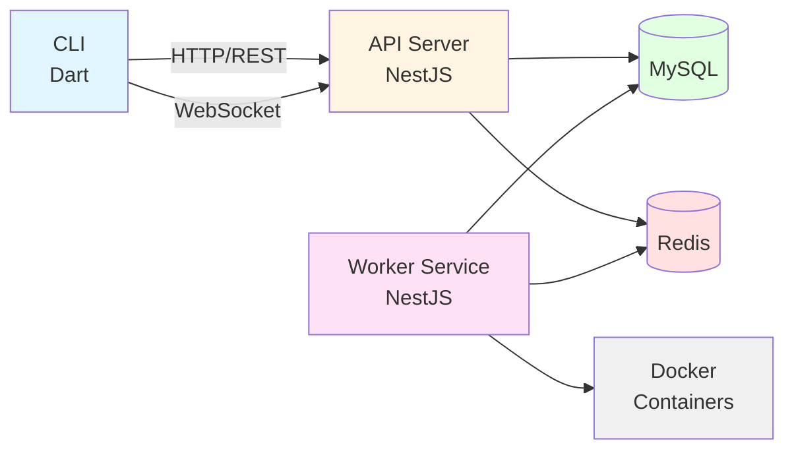

# 풀스택 서비스 프로그래밍 프로젝트 레포지토리

2025-2에 수강한 풀스택 서비스 프로그래밍 강의에서 진행하는 프로젝트의 레포지토리입니다.

## 시스템 아키텍처



## 주요 컴포넌트

### 1. CLI (Command-Line Interface)

- **언어**: Dart 3.9+
- **기능**: 사용자 인증, 코드 실행, LSP 통합
- **주요 라이브러리**: dio, socket_io_client, dart_console

### 2. API Server

- **언어**: TypeScript (NestJS 11.x)
- **포트**: 3000
- **기능**:
  - REST API 제공 (인증, 사용자 관리, 코드 실행)
  - WebSocket을 통한 LSP 게이트웨이
  - 작업 큐 관리 (BullMQ)
- **주요 모듈**:
  - Auth Module: JWT 기반 인증
  - Execution Module: 코드 실행 작업 관리
  - Language Server Module: LSP 세션 및 WebSocket 통신
  - Queue Module: BullMQ 통합

### 3. Worker Service

- **언어**: TypeScript (NestJS 11.x)
- **기능**: 백그라운드 작업 처리
  - Redis 큐에서 실행 작업 소비
  - Docker 컨테이너 생성 및 관리
  - 코드 실행 및 결과 수집
  - 상태 업데이트
- **동시 처리**: 최대 4개 작업

### 4. 데이터베이스 및 캐시

- **MySQL 8.4**: 사용자 데이터, 실행 작업, 상태 로그
- **Redis 8.2**: 작업 큐, LSP 세션 캐시

### 5. Docker 컨테이너

- **Dart Execution Container**:
  - 격리된 환경에서 사용자 코드 실행
  - 리소스 제한 (256MB RAM, 0.5 CPU, 30초 타임아웃)
  - 네트워크 접근 차단
- **Dart LSP Container**:
  - 언어 서버 프로토콜 지원
  - 코드 정의 이동, 자동완성 등

## 기술 스택

| 레이어           | 기술                                      |
| ---------------- | ----------------------------------------- |
| **CLI**          | Dart, dio, socket_io_client, dart_console |
| **Backend**      | NestJS, TypeScript, Express               |
| **WebSocket**    | Socket.io                                 |
| **데이터베이스** | MySQL 8.4, TypeORM                        |
| **캐시/큐**      | Redis 8.2, BullMQ, ioredis                |
| **컨테이너화**   | Docker, Dockerode                         |
| **인증**         | JWT (jsonwebtoken)                        |
| **파일 업로드**  | Multer                                    |
| **유틸리티**     | ULID, class-validator, class-transformer  |

## 실행

백엔드 실행:

```sh
docker compose up
```

CLI 실행 (cli 디렉토리에서):

```sh
dart bin/main.dart --base-url http://localhost:3000
```

## 라이선스

[MIT License](./LICENSE)
